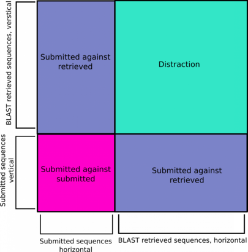
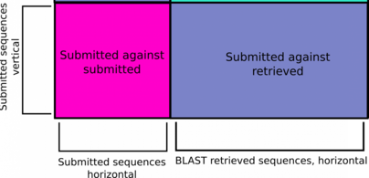

```{r setup, include=FALSE}
knitr::opts_chunk$set(echo = TRUE)
```

## Displaying genetic distances in a heatmap and relatedness in a phylogenetic tree

Load some packages

```{r init, warning=FALSE, message=FALSE}
library(ape)
library(tibble)
library(tidyr)
library(dplyr)
library(plotly)
library(RColorBrewer)
```

Read in the multiple sequence alignment file

```{r read_dna}
# Read in the alignment file
aln <- read.dna('example.aln', format = 'fasta')

# Calculate the genetic distances between sequences using the K80 model, as.mattrix makes the rest easier
alnDist <- dist.dna(aln, model = "K80", as.matrix = TRUE)
```


### Reduction of heatmap to focus on the important data

The pipeline mentioned uses the **Basic Local Alignment Search Tool** (BLAST) to retrieve previously sampled sequences and adds these retrieved sequences to the analysis.  [BLAST](https://blast.ncbi.nlm.nih.gov/Blast.cgi) is like a search engine you use on the web, but for protein or DNA sequences.  By doing this important sequences from retrospective samples are included which enables PhyloPi to be aware of past sequences and not just batch per batch aware.  Have a look at the [paper](https://journals.plos.org/plosone/article/comments?id=10.1371/journal.pone.0213241) for some examples.


The data we have is ready to use for heatmap plotting purposes, but since the data also contains previously samples sequences, comparing those sequences amongst themselves would be a distraction.  We are interested in those samples, but only compare to the current batch of samples analysed.  The figures below should explain this a bit better. 





From the image above you can see that, typical of a heatmap, it is symmetrical on the diagonal.  We show submitted *vs* retrieved samples in both the horizontal and vertical direction.  Notice also, as annotated as "Distraction", are the previous samples compared amongst themselves.  We are not interested in those sample now as we would already have acted on any issues then.  What we want instead, is a heatmap as depicted in the image below.





Luckily for us, we have a very powerful tool to our disposal, **R**, and plenty of really useful and convenient packages, like `dplyr`.


```{r gather}
alnDistLong <- 
  alnDist %>% 
  as.data.frame(stringsToFactors = FALSE) %>% 
  rownames_to_column(var = "sample_1") %>% 
  gather(key = "sample_2", value = "distance", -sample_1, na.rm = TRUE) %>% 
  arrange(distance)

```


Create a new variable, combined, we will paste the names for `sample_1` and `sample_2` together


Final cleanup and removal of distracting data

```{r compare_with_new_data}
# get the names of samples originally in the fasta file used for submission
qSample <- names(read.dna("example.fasta", format = "fasta"))

# compute new order of samples, so the new alignment is in the order of the heatmap example
sample_1 <- unique(alnDistLong$sample_1)
new_order <- c(sort(qSample), setdiff(sample_1, qSample))
```

Plot the heatmap using `plotly` for interactivity

```{r plot_heatmap}
alnDistLong %>% 
  filter(
    sample_1 %in% qSample,
    sample_1 != sample_2
    ) %>% 
  mutate(
    sample_2 = factor(sample_2, levels = new_order)
  ) %>% 
  plot_ly(
    x = ~sample_2,
    y = ~sample_1,
    z = ~distance,
    type = "heatmap", colors = brewer.pal(11, "RdYlBu"), 
    zmin = 0.0, zmax = 0.03,  xgap = 2, ygap = 1
) %>% 
  layout(
    margin = list(l = 100, r = 10, b = 100, t = 10, pad = 4), 
    yaxis = list(tickfont = list(size = 10), showspikes = TRUE),
    xaxis = list(tickfont = list(size = 10), showspikes = TRUE)
  )
```


## Phylogenetic tree

Above we used the package [ape](http://ape-package.ird.fr/) to calculate the genetic distances for the heatmap. 

Another way of looking at our alignment data is to use phylogenetic inference. The PhyloPi pipeline saves each step of phylogenetic inference to allow the user to intercept at any step.  We can use the newick tree file (a text file formatted as newick) and draw our own tree.

```{r, fig.height=12, fig.width=12}
tree <- read.tree("example-tree.txt")
plot.phylo(
  tree, cex = 0.8, 
  use.edge.length = TRUE, 
  tip.color = 'blue', 
  align.tip.label = FALSE, 
  show.node.label = TRUE
)
nodelabels("This one", 9, frame = "r", bg = "red", adj = c(-8.2,-46))
```
We have highlighted a node with a red block, with the text "This one" which we can now discuss.  We have three leaves in this node, KM050043, KM050042, KM050041 and if you would look up these accession numbers at [NCBI](https://www.ncbi.nlm.nih.gov/nuccore/KM050041.1/) you will notice the Title of the paper it is tied to:

"HIV transmission. Selection bias at the heterosexual HIV-1 transmission bottleneck"

In this paper, the authors looked and selection bias when the infection is transmitted.  They found that in a pool of viral quasispecies transmission is biased to benefit the fittest viral quasispecie.  The node highlighted above shows the kind of clustering one would expect with a study like the one mentioned above.  You will also notice plenty of other nodes which you can explore using the accession number and searching for it at https://www.hiv.lanl.gov/components/sequence/HIV/search/search.html


